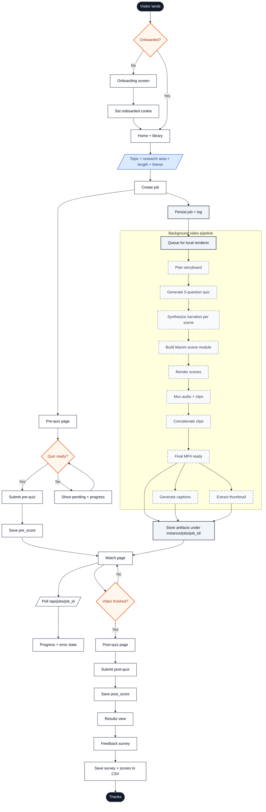

# Current system flow

```mermaid
graph TD
    Start([Visitor lands]) --> OnboardCheck{Onboarded?}
    OnboardCheck -- No --> Onboarding[Onboarding screen]
    Onboarding --> SetCookie[Set onboarded cookie]
    SetCookie --> Home[Home + library]

    OnboardCheck -- Yes --> Home
    Home --> Input[/Topic + research area + length + theme/]
    Input --> Submit[Create job]
    Submit --> JobRow[Persist job + log]
    JobRow --> Queue[Queue for local renderer]

    Submit --> PreQuiz[Pre-quiz page]
    PreQuiz --> QuizReady{Quiz ready?}
    QuizReady -- No --> PreQuizWait[Show pending + progress]
    PreQuizWait --> QuizReady
    QuizReady -- Yes --> PreQuizSubmit[Submit pre-quiz]
    PreQuizSubmit --> SavePre[Save pre_score]
    SavePre --> Watch[Watch page]

    Watch --> Poll[/Poll /api/jobs/job_id/]
    Poll --> Status[Progress + error state]

    subgraph Pipeline["Background video pipeline"]
        Queue --> Storyboard[Plan storyboard]
        Storyboard --> Quiz[Generate 5-question quiz]
        Quiz --> Audio[Synthesize narration per scene]
        Audio --> Build[Build Manim scene module]
        Build --> Render[Render scenes]
        Render --> Mux[Mux audio + clips]
        Mux --> Concat[Concatenate clips]
        Concat --> Final[Final MP4 ready]
        Final --> Captions[Generate captions]
        Final --> Thumb[Extract thumbnail]
    end

    Final --> Artifacts[Store artifacts under instance/jobs/job_id/]
    Captions --> Artifacts
    Thumb --> Artifacts
    Artifacts --> Watch

    Watch --> VideoDone{Video finished?}
    VideoDone -- No --> Watch
    VideoDone -- Yes --> PostQuiz[Post-quiz page]
    PostQuiz --> PostSubmit[Submit post-quiz]
    PostSubmit --> SavePost[Save post_score]
    SavePost --> Results[Results view]
    Results --> Survey[Feedback survey]
    Survey --> SaveSurvey[Save survey + scores to CSV]
    SaveSurvey --> End([Thanks])

    classDef startEnd fill:#111827,stroke:#374151,color:#ffffff,stroke-width:2px;
    classDef input fill:#dbeafe,stroke:#2563eb,color:#1e3a8a,stroke-width:1.5px;
    classDef process fill:#ffffff,stroke:#475569,color:#0f172a,stroke-width:1.5px;
    classDef decision fill:#fff7ed,stroke:#ea580c,color:#9a3412,stroke-width:2px;
    classDef output fill:#ecfdf5,stroke:#16a34a,color:#166534,stroke-width:1.5px;
    classDef system fill:#f8fafc,stroke:#64748b,color:#334155,stroke-width:1.5px,stroke-dasharray: 5 5;
    classDef storage fill:#f1f5f9,stroke:#0f172a,color:#0f172a,stroke-width:1.5px;

    class Start,End startEnd;
    class Input input;
    class OnboardCheck,QuizReady,VideoDone decision;
    class Onboarding,SetCookie,Home,Submit,PreQuiz,PreQuizWait,PreQuizSubmit,SavePre,Watch,Poll,Status,PostQuiz,PostSubmit,SavePost,Results,Survey,SaveSurvey process;
    class Storyboard,Quiz,Audio,Build,Render,Mux,Concat,Final,Captions,Thumb system;
    class JobRow,Queue,Artifacts storage;
```
